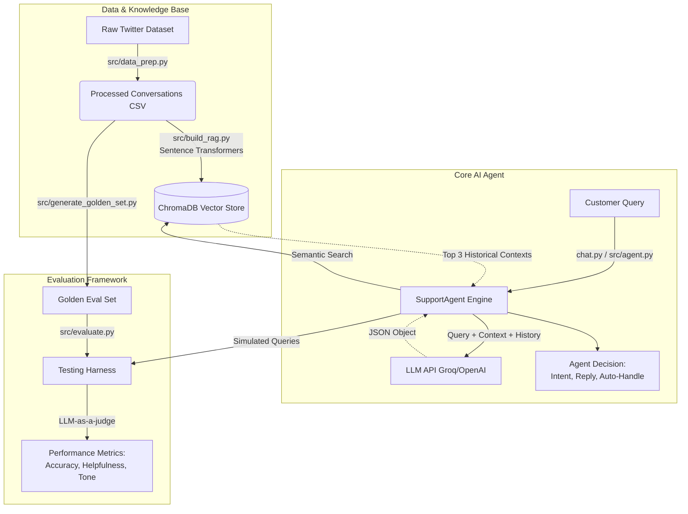

# AI Customer Support Agent (AppleSupport)

This repository contains an end-to-end pipeline for a customer support AI agent. The agent is grounded in historical data using RAG (Retrieval-Augmented Generation) to draft replies, classify intents, and decide whether to auto-handle or escalate a customer query.

## Quickstart (Reproduce in < 15 mins)

### 1. Setup Environment
Install the dependencies:
```bash
pip install -r requirements.txt
```

### 2. Configure LLM API Key (Optional but Recommended)
The agent uses OpenAI's GPT-4o-mini to draft replies and evaluate quality. If you don't provide a key, the pipeline will fallback to a dummy mocked response.
```bash
export OPENAI_API_KEY="sk-your-api-key"
```

### 3. Run the Pipeline
We have provided a pre-processed dataset (`data/processed_conversations.csv`) and a built ChromaDB vector database (`data/chroma_db`) with 5000 historical AppleSupport conversations.
You can run the agent on the Golden Evaluation Set (200 examples) using:

```bash
# Run pipeline on the first 10 examples from the golden set (for speed)
python3 src/run_pipeline.py --input data/golden_eval.csv --output data/predictions.csv --max 10
```

To run the full evaluation harness (Automated Metrics + LLM-as-a-judge):
```bash
python3 src/evaluate.py --input data/golden_eval.csv --output data/evaluation_results.csv --max 20
```

## System Architecture



## Repository Structure

- `src/data_prep.py`: Filters the raw Twitter dataset for AppleSupport threads.
- `src/build_rag.py`: Builds a ChromaDB vector store using Sentence Transformers.
- `src/agent.py`: The core RAG and prompt logic.
- `src/generate_golden_set.py`: Heuristic script used to simulate the manual creation of the golden test set.
- `src/evaluate.py`: Calculates classification metrics and uses LLM-as-a-judge for draft quality.
- `golden_set_methodology.md`: Explanation of how the 200 golden examples were sampled and labeled.
- `data/`: Contains the processed datasets and ChromaDB files.

## Evaluation & Golden Set
We sampled 200 random queries for the **Golden Evaluation Set**. Since this was built autonomously, we applied strict regex heuristic rules to serve as ground-truth labels for Intent and Auto-Handle vs. Escalate decisions.
The `evaluate.py` script computes Accuracy/F1 for these categories, and utilizes an LLM Judge prompt to score the agent's drafted replies on Tone, Helpfulness, and Groundedness out of 5.
